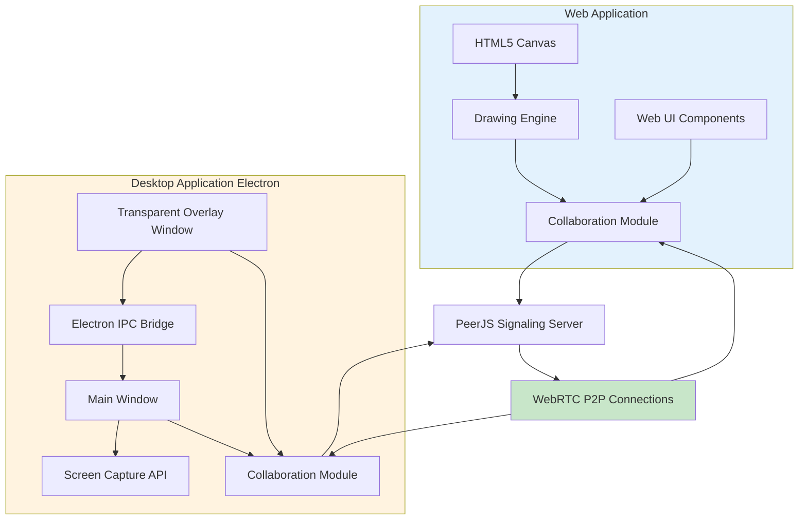

# CFD Penney

**Collaborative Annotation Tool for Real-Time Drawing, Screen Sharing, and Image Annotation**

CFD Penney is a free, dual-platform collaborative annotation tool that enables real-time drawing, screen sharing, and image annotation. Available as both a **web application** (browser-based, no installation) and a **desktop application** (Electron app for Windows, macOS, and Linux), CFD Penney is perfect for teams, educators, and anyone who needs to collaborate visually.

**Choose your platform:**
- 🌐 **Web App** - Instant access from any browser, works on mobile and tablets
- 💻 **Desktop App** - Professional-grade screen capture with true transparent overlay on any application

[](https://github.com/codefrydev/CFDPenney)

### 🌐 Live Demo

**Production URL:** [https://codefrydev.in/CFDPenney](https://codefrydev.in/CFDPenney)

> **Note:** Peer-to-peer connections are currently not working in production but work correctly when running locally. For full collaboration features, please run the application locally as described in the [Installation](#installation) section.

## Features

### 🎨 Drawing Tools (Both Platforms)
- **Pen Tool** - Freehand drawing with customizable stroke width
- **Eraser** - Remove parts of your drawing
- **Text Tool** - Add text annotations
- **Shape Tools** - Line, Arrow, Rectangle, Circle, Ellipse, Triangle, Diamond, Star, Pentagon, Hexagon, Octagon
- **Fill Support** - Fill shapes with custom colors
- **Stickers** - Add fun stickers to your canvas
- **Select Tool** - Select and manipulate drawn elements

### 🖼️ Three Annotation Modes (Both Platforms)
- **Board Mode** - Clean whiteboard for freeform drawing
- **Screen Mode** - Share and annotate your screen in real-time
- **Image Mode** - Upload and annotate images

### 👥 Collaboration (Both Platforms)
- **Real-Time Collaboration** - Multiple users can draw simultaneously
- **Room-Based System** - 5-character room codes for easy sharing
- **Peer-to-Peer** - Direct connections using WebRTC
- **Session Discovery** - Find and join active sessions
- **Connection Status** - Visual indicators for connection state
- **Cross-Platform** - Web and desktop users can collaborate in the same session

### 💻 Desktop App Exclusive Features
- **True Transparent Overlay** - Annotate directly over any application or screen
- **System-Level Screen Capture** - Capture entire screen, specific windows, or individual applications
- **Always-on-Top Annotation Layer** - Overlay stays on top while you work
- **Keyboard Shortcuts** - Quick mode switching and controls for efficient workflow
- **Click-Through Mode** - Toggle between view-only and interactive drawing modes
- **Multi-Monitor Support** - Works across multiple displays
- **Native Performance** - Smooth rendering with hardware acceleration

### 🌐 Web App Exclusive Features
- **Zero Installation** - Start collaborating instantly from any browser
- **Mobile & Tablet Support** - Touch-friendly interface for phones and tablets
- **Cross-Device Compatibility** - Works on any device with a modern browser
- **No Admin Rights Needed** - Perfect for restricted corporate environments

### 🎯 Additional Features (Both Platforms)
- **Undo/Redo** - Full history management
- **Snapshot Export** - Capture and download your canvas
- **Dark/Light Theme** - Toggle between themes
- **Color Picker** - Preset colors and custom color selection
- **Stroke Width Control** - Adjustable line thickness
- **Responsive Design** - Adapts to any screen size

## Choosing Web vs Desktop

Not sure which version to use? Here's a quick comparison:

| Use Web App When... | Use Desktop App When... |
|---------------------|-------------------------|
| You need instant access without installation | You need professional screen capture capabilities |
| Working on mobile or tablet devices | You want to annotate over any desktop application |
| Behind restrictive IT policies or can't install software | You need a persistent overlay that stays on top |
| Quick collaboration or demo sessions | Hosting extended training or presentation sessions |
| Accessing from multiple devices | Working primarily from a single workstation |
| Internet connectivity is limited (smaller footprint) | You need system-level permissions for screen capture |

**Both platforms can:**
- Host or join collaboration sessions
- Use the same room codes and collaborate together
- Access all drawing tools and annotation features
- Export and share your work

## Getting Started

### Prerequisites

**For Web Application:**
- Modern web browser with JavaScript enabled
- HTML5 and WebRTC support
- For screen sharing: Browser permissions for screen capture

**For Desktop Application:**
- Windows 10/11, macOS 10.14+, or Linux (Ubuntu, Fedora, Debian)
- Node.js 16+ (for running from source)
- 100MB free disk space

### Installation

#### Web Application

CFD Penney is a client-side web application. No server setup is required for basic functionality.

1. Clone the repository:
```bash
git clone https://github.com/codefrydev/CFDPenney.git
cd CFDPenney
```

2. Serve the files using a local web server:

**Using Python:**
```bash
# Python 3
python -m http.server 8000

# Python 2
python -m SimpleHTTPServer 8000
```

**Using Node.js (http-server):**
```bash
npx http-server -p 8000
```

**Using PHP:**
```bash
php -S localhost:8000
```

3. Open your browser and navigate to `http://localhost:8000`

#### Desktop Application

**Option 1: Run from Source (Recommended for Development)**

1. Clone the repository (if not already done):
```bash
git clone https://github.com/codefrydev/CFDPenney.git
cd CFDPenney/DeskTopApp
```

2. Install dependencies:
```bash
npm install
```

3. Start the application:
```bash
npm start
```

**Option 2: Build Installers**

Build platform-specific installers:

```bash
# Build for your current platform
npm run build

# Build for specific platforms
npm run build:mac      # macOS (.dmg, .zip)
npm run build:win      # Windows (.exe, portable)
npm run build:linux    # Linux (.AppImage, .deb)
```

The built applications will be in the `DeskTopApp/dist` directory.

**For detailed desktop app architecture and development info, see [DeskTopApp/README.md](DeskTopApp/README.md)**

### Deployment

#### Web Application Deployment

For production deployment, simply upload all files to a web server that supports static file hosting. The application works entirely client-side.

**Recommended Hosting Options:**
- GitHub Pages
- Netlify
- Vercel
- Cloudflare Pages
- Any static file hosting service

#### Desktop Application Distribution

**Automated Builds (CI/CD):**

The desktop application is automatically built for all platforms when changes are pushed to the `main` branch. Builds are triggered by:
- Pushes to `main` branch (when `DeskTopApp/` files change)
- Manual workflow dispatch from GitHub Actions

**Automated builds create:**
- **Windows**: Installer (.exe) and Portable (.zip)
- **macOS**: Disk Image (.dmg) and Archive (.zip)
- **Linux**: AppImage and Debian Package (.deb)

Build artifacts are available as:
- **GitHub Actions Artifacts** - Downloadable from workflow runs (retained for 30 days)
- **GitHub Releases** - Automatically published releases with all platform builds

**Manual Building:**

To build locally, the desktop app uses `electron-builder` to create platform-specific installers:

```bash
cd DeskTopApp

# Build for all platforms
npm run build

# Platform-specific builds
npm run build:mac      # Creates .dmg and .zip for macOS
npm run build:win      # Creates .exe installer and portable .exe for Windows
npm run build:linux    # Creates .AppImage and .deb for Linux
```

The built applications will be in the `DeskTopApp/dist` directory.

**Distribution Options:**
- **GitHub Releases** - Automated via CI/CD (recommended)
- **GitHub Actions Artifacts** - Download from workflow runs
- **Self-Hosted** - Host installers on your own server
- **Microsoft Store** - (Future) Submit Windows builds
- **Mac App Store** - (Future) Submit macOS builds with proper signing
- **Snap Store / Flatpak** - Linux distribution channels

**Code Signing (Recommended for Production):**

For production releases, code signing is recommended:
- **macOS**: Requires Apple Developer account and certificate
  - Set `CSC_LINK` and `CSC_KEY_PASSWORD` secrets in GitHub Actions
- **Windows**: Requires code signing certificate to avoid SmartScreen warnings
  - Set `CSC_LINK` and `CSC_KEY_PASSWORD` secrets in GitHub Actions
- Configure signing in `electron-builder` configuration or via environment variables

## Usage Guide

### Web Application Usage

#### Starting a Collaboration Session

1. Click the **"Collaborate"** button in the header
2. Click **"Host Session"** to create a new room
3. A 5-character room code will be generated (e.g., `A3K7M`)
4. Share this code with others to invite them to your session

#### Joining a Session

1. Click the **"Collaborate"** button
2. Enter the 5-character room code in the input field
3. Click **"Join"** to connect to the session

Alternatively, you can join directly via URL by appending the room code:
```
https://codefrydev.in/CFDPenney/?code=A3K7M
```

#### Drawing Tools

- **Select a tool** from the left sidebar
- **Choose a color** from the color palette or use the custom color picker
- **Adjust stroke width** by hovering over the stroke indicator at the bottom of the sidebar
- **For shapes**: Toggle fill on/off and select a fill color

#### Mode Switching

- **Board Mode** - Click the "Board" button for a clean whiteboard
- **Screen Mode** - Click "Screen" to share your screen (requires browser permissions)
- **Image Mode** - Click "Image" to upload and annotate an image file

#### Screen Sharing (Web)

1. Click the **"Screen"** mode button
2. Grant browser permissions when prompted
3. Select the screen/window/tab you want to share
4. Your screen will appear as the background for annotation
5. Use the controls at the bottom to pause or stop sharing

### Desktop Application Usage

#### Getting Started with Desktop App

1. **Launch the application** - Start CFD Penney Desktop
2. **Select what to share** - Click "Select Screen" to choose:
   - Entire screen
   - Specific window
   - Individual application
3. **Start sharing** - Click "Start Sharing" to begin capture
4. **Host a session** - Click "Host Session" to generate a share code
5. **Share the code** - Give the code to others (they can join from web or desktop)

#### Using the Transparent Overlay

The desktop app features a transparent overlay that sits on top of your shared screen:

**View Mode (Default):**
- Overlay is click-through - you can interact with applications underneath
- See pointers and annotations from remote users
- Press `P` to activate this mode

**Draw Mode:**
- Overlay captures mouse input for drawing
- Draw annotations that appear for all session participants
- Press `D` to activate this mode

#### Desktop Keyboard Shortcuts

| Key | Action |
|-----|--------|
| `P` | Switch to Pointer/View mode (click-through enabled) |
| `D` | Switch to Draw mode (interactive annotation) |
| `Ctrl/Cmd + C` | Clear all annotations from overlay |
| `Esc` | Return to Pointer/View mode |
| `H` | Show/hide keyboard shortcuts help |

#### Cross-Platform Collaboration

Desktop and web users can collaborate seamlessly:
- **Desktop hosts** - Share screen with transparent overlay, generate room code
- **Web users join** - Enter room code to view and annotate the shared screen
- **Both can draw** - All participants see annotations in real-time
- **Unique colors** - Each participant has a distinct color for their pointer and strokes

### General Keyboard Shortcuts (Both Platforms)

- **Undo**: Click the undo button
- **Redo**: Click the redo button
- **Clear**: Click the trash icon to clear the entire canvas

## Technical Details

### Technology Stack

- **Vanilla JavaScript (ES6 Modules)** - Core application logic
- **PeerJS** - Peer-to-peer WebRTC connections
- **HTML5 Canvas** - Drawing and rendering
- **Tailwind CSS** - Styling and responsive design
- **Lucide Icons** - Icon library

### Architecture

CFD Penney uses a unified collaboration infrastructure that allows web and desktop applications to work together seamlessly:



#### Web Application Architecture

The web application follows a modular architecture:

```
js/
├── main.js                 # Application entry point
├── state.js                # Global state management
├── config.js               # Configuration constants
├── canvas.js               # Canvas rendering
├── drawing.js              # Drawing logic
├── tools.js                # Tool management
├── collaboration.js        # Collaboration API
├── collaboration/
│   ├── collaborationCore.js    # Core collaboration lifecycle
│   ├── dataConnection.js       # Data channel management
│   ├── videoCall.js            # Screen sharing
│   ├── messageHandler.js       # Message processing
│   ├── messageSender.js        # Message sending
│   ├── connectionStatus.js     # Connection UI updates
│   ├── coordinateUtils.js      # Coordinate normalization
│   └── urlUtils.js             # URL code handling
├── shapes/                 # Shape tools
├── stickers/               # Sticker system
├── selection/              # Selection and manipulation
└── ...                     # Other modules
```

#### Desktop Application Architecture

The desktop app uses a **dual-window system** for true transparent overlay:

```
┌─────────────────────────────┐
│   Main Window (screen.html) │
│   ┌─────────────────────┐   │
│   │  Screen Capture     │   │  ← Displays captured screen/window
│   │  <video> stream     │   │
│   └─────────────────────┘   │
└─────────────────────────────┘
         ↓ aligned & synced
┌─────────────────────────────┐
│ Overlay Window (overlay.html)│
│  ┌─────────────────────┐    │
│  │  Transparent Canvas │    │  ← Always-on-top, click-through
│  │  Pointers + Strokes │    │
│  └─────────────────────┘    │
└─────────────────────────────┘
```

**Key Desktop Components:**
- **Main Process** (`main.js`) - Window management, IPC coordination
- **Screen Window** (`screen.js`) - Capture, WebRTC, session hosting
- **Overlay Window** (`overlay.js`) - Transparent annotation layer
- **Collaboration System** - Shared with web app, coordinate normalization

**Why Separate Windows?**
- True transparency over any application
- No video re-encoding (maintains quality)
- Independent rendering pipelines
- Lower latency and CPU usage

For detailed desktop architecture, see [DeskTopApp/README.md](DeskTopApp/README.md)

### Key Dependencies

The application uses CDN-hosted dependencies:

- **PeerJS** (`https://unpkg.com/peerjs@1.5.2/dist/peerjs.min.js`) - WebRTC abstraction
- **Tailwind CSS** (`https://cdn.tailwindcss.com`) - Utility-first CSS framework
- **Lucide Icons** (`https://unpkg.com/lucide@latest`) - Icon library

### State Management

The application uses a centralized state object (`state.js`) that manages:
- Current tool selection
- Drawing state (isDrawing, currentPath, etc.)
- Collaboration state (peer connections, room code)
- Canvas history (undo/redo)
- Theme preferences
- Mode (board/screen/image)

## Collaboration Setup

### How It Works

CFD Penney uses **PeerJS** for peer-to-peer WebRTC connections:

1. **Host creates a session** - Generates a unique 5-character room code
2. **PeerJS connection** - Host's peer ID becomes the room code
3. **Joiners connect** - Other users connect using the room code as the peer ID
4. **Data channels** - Real-time bidirectional data channels sync drawing actions
5. **Screen sharing** - Video streams are shared via WebRTC media channels

### TURN/STUN Server Configuration

The application uses the following ICE servers for WebRTC connections:

**STUN Servers:**
- `stun:stun.l.google.com:19302`
- `stun:stun1.l.google.com:19302`

**TURN Servers:**
- `turn:openrelay.metered.ca:80` (with credentials)
- `turn:openrelay.metered.ca:443` (with credentials)

These servers are configured in `js/collaboration/collaborationCore.js`. To use custom TURN/STUN servers, modify the `iceServers` array in the PeerJS configuration.

**Note:** For production deployments behind restrictive firewalls or NAT, you may need to configure your own TURN servers for reliable connections.

### Connection Troubleshooting

If you experience connection issues:

1. **Check browser console** - Look for PeerJS error messages
2. **Verify TURN servers** - Ensure TURN servers are accessible
3. **Check firewall/NAT** - Some networks block WebRTC traffic
4. **Try different network** - Test on a different network to isolate issues
5. **Browser permissions** - Ensure camera/microphone permissions are granted if needed

### Known Issues

**Web Application:**
- **Production Environment**: Peer-to-peer connections are not working on the production deployment at [https://codefrydev.in/CFDPenney](https://codefrydev.in/CFDPenney). Collaboration features work correctly when running the application locally. This may be due to:
  - PeerJS signaling server connectivity issues
  - Network/firewall restrictions on the production server
  - HTTPS/WSS protocol requirements for WebRTC in production
  
  **Workaround**: Run the application locally using the installation instructions above for full collaboration functionality.

**Desktop Application:**
- **macOS Permissions**: First-time users need to grant screen recording permissions in System Preferences > Security & Privacy > Screen Recording
- **Linux Window Managers**: Some window managers (e.g., tiling WMs) may not fully support always-on-top or transparent windows
- **Windows Defender**: May show security warnings on first run - this is normal for Electron apps
- **Overlay Alignment**: On multi-monitor setups with different DPI scaling, overlay may require manual repositioning

**Both Platforms:**
- **Restrictive Networks**: Corporate firewalls or restrictive NATs may block WebRTC connections. Consider setting up custom TURN servers for production use.
- **Browser Compatibility**: Screen sharing in web app requires modern browser with WebRTC support

### Discovery Service

The application includes a peer-to-peer discovery service that allows users to find active sessions. The discovery service uses a fixed peer ID (`ANNONATE_DISCOVERY_de97662b-caa7-46a6-aca7-68410515c969`) that acts as a central registry.

- Sessions are registered with a 5-minute timeout
- The first user to connect becomes the discovery host
- Other users can query available sessions

## Platform & Browser Support

### Web Application - Browser Support

**Supported Browsers:**
- **Chrome/Chromium** (Recommended) - Full support
- **Firefox** - Full support
- **Safari** - Full support (iOS 11+)
- **Edge** - Full support

**Required Permissions:**
- **Screen Sharing** - Required for Screen mode
- **Camera/Microphone** - Not required (no video/audio chat)

**Mobile Support:**

CFD Penney web app is responsive and works on mobile devices:
- Touch-friendly interface
- Responsive layout adapts to screen size
- Canvas supports touch input
- Works on iOS, Android, and tablets
- Some features may have limited functionality on mobile

### Desktop Application - Platform Support

**Supported Operating Systems:**

| Platform | Minimum Version | Architecture | Status |
|----------|----------------|--------------|--------|
| **Windows** | Windows 10 | x64, arm64 | ✅ Fully Supported |
| **Windows** | Windows 11 | x64, arm64 | ✅ Fully Supported |
| **macOS** | macOS 10.14 (Mojave) | x64, arm64 (M1/M2) | ✅ Fully Supported |
| **macOS** | macOS 11+ (Big Sur+) | Universal | ✅ Fully Supported |
| **Linux** | Ubuntu 18.04+ | x64 | ✅ Fully Supported |
| **Linux** | Fedora 32+ | x64 | ✅ Fully Supported |
| **Linux** | Debian 10+ | x64 | ✅ Fully Supported |

**System Requirements:**
- **RAM**: 512MB minimum, 1GB recommended
- **Disk Space**: 100MB for installation
- **Display**: 1280x720 minimum resolution
- **Network**: Internet connection for P2P collaboration

**Desktop Features by Platform:**

| Feature | Windows | macOS | Linux |
|---------|---------|-------|-------|
| Screen Capture | ✅ | ✅ | ✅ |
| Window Capture | ✅ | ✅ | ✅ |
| Transparent Overlay | ✅ | ✅ | ✅ |
| Multi-Monitor | ✅ | ✅ | ✅ |
| Keyboard Shortcuts | ✅ | ✅ | ✅ |
| Auto-Updates | 🔄 Future | 🔄 Future | 🔄 Future |

**Known Platform Limitations:**
- **Linux**: Some window managers may have limitations with always-on-top windows or transparency
- **macOS**: Screen recording permission required (granted via System Preferences)
- **Windows**: May require running as administrator for certain system-level captures

## Project Structure

```
Annonate/
├── index.html              # Landing page
├── canvas.html             # Web application main page
├── js/                     # Web app JavaScript modules
│   ├── main.js             # Entry point
│   ├── state.js            # State management
│   ├── config.js           # Configuration
│   ├── canvas.js           # Canvas operations
│   ├── drawing.js          # Drawing logic
│   ├── tools.js            # Tool management
│   ├── collaboration.js    # Collaboration API
│   ├── collaboration/      # Collaboration modules
│   │   ├── collaborationCore.js    # Core collaboration lifecycle
│   │   ├── dataConnection.js       # Data channel management
│   │   ├── videoCall.js            # Screen sharing
│   │   ├── messageHandler.js       # Message processing
│   │   ├── messageSender.js        # Message sending
│   │   ├── connectionStatus.js     # Connection UI updates
│   │   ├── coordinateUtils.js      # Coordinate normalization
│   │   ├── clipboardUtils.js       # Clipboard operations
│   │   └── urlUtils.js             # URL code handling
│   ├── shapes/             # Shape tools
│   ├── stickers/           # Sticker system
│   ├── selection/          # Selection tools
│   └── ...                 # Other modules
├── styles/                 # CSS files
│   ├── main.css            # Main styles
│   ├── base.css            # Base styles
│   ├── variables.css       # CSS variables
│   ├── landing/            # Landing page styles
│   └── ...                 # Other style files
├── DeskTopApp/             # Desktop Electron application
│   ├── main.js             # Electron main process
│   ├── preload.js          # IPC bridge (secure context)
│   ├── screen.html         # Main window UI
│   ├── screen.js           # Screen capture + WebRTC
│   ├── overlay.html        # Overlay window UI
│   ├── overlay.js          # Transparent annotation layer
│   ├── state.js            # Desktop app state management
│   ├── collaboration/      # WebRTC collaboration (shared architecture)
│   │   ├── collaborationCore.js    # Peer lifecycle
│   │   ├── dataConnection.js       # Connection management
│   │   ├── messageHandler.js       # Event processing
│   │   ├── messageSender.js        # Event broadcasting
│   │   └── coordinateUtils.js      # Normalization helpers
│   ├── styles/             # Desktop-specific styles
│   ├── package.json        # Desktop app dependencies
│   └── README.md           # Desktop architecture details
├── favicon-32x32.png       # Favicon
├── og-image.jpg            # Open Graph image
├── robots.txt              # SEO robots file
├── sitemap.xml             # SEO sitemap
├── privacy.html            # Privacy policy
├── terms.html              # Terms of service
└── README.md               # This file
```

## Contributing

Contributions are welcome! If you'd like to contribute:

1. Fork the repository
2. Create a feature branch (`git checkout -b feature/amazing-feature`)
3. Commit your changes (`git commit -m 'Add some amazing feature'`)
4. Push to the branch (`git push origin feature/amazing-feature`)
5. Open a Pull Request

### Development Guidelines

- Follow existing code style
- Add comments for complex logic
- Test your changes across different browsers
- Ensure mobile responsiveness

## License

This project is open source. Please check the repository for specific license information.

## Support

For issues, questions, or contributions, please visit the [GitHub repository](https://github.com/codefrydev/CFDPenney).

## Acknowledgments

**Web Application:**
- Built with [PeerJS](https://peerjs.com/) for WebRTC functionality
- Icons by [Lucide](https://lucide.dev/)
- Styling with [Tailwind CSS](https://tailwindcss.com/)

**Desktop Application:**
- Built with [Electron](https://www.electronjs.org/) for cross-platform desktop apps
- [PeerJS](https://peerjs.com/) for WebRTC peer connections
- HTML5 Canvas for transparent overlay rendering

**Common Technologies:**
- WebRTC for real-time communication
- HTML5 Canvas for drawing and rendering
- ES6 Modules for clean, modular code architecture

---

**CFD Penney** - Collaborate visually, anywhere, anytime.

